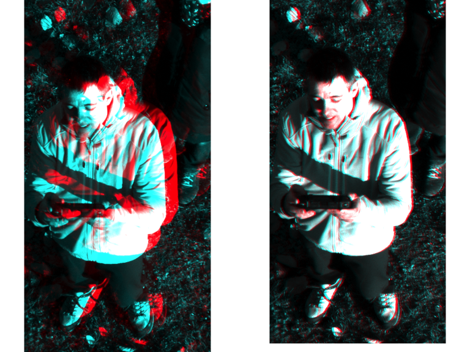
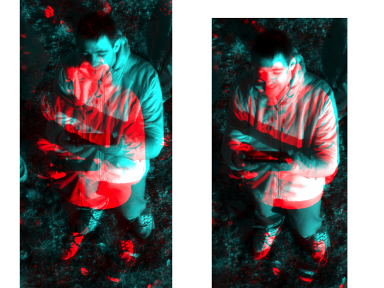
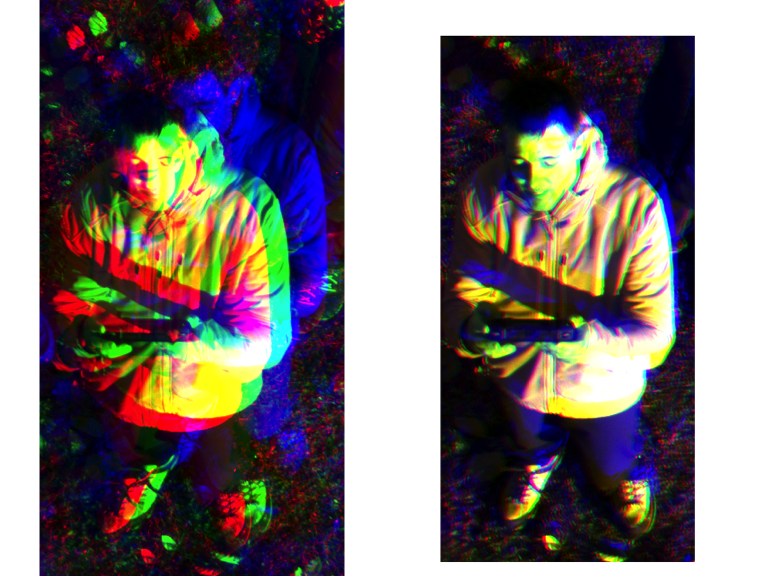

Drone Multispectral Coregistration (Crop Dataset)
================
Iris Nana Obeng
2026-03-12

``` r
library(terra)

setwd("~/Desktop/drone ms coregistration")
```

## Load multispectral bands

``` r
files <- c("ms_crop_gre.tif", "ms_crop_red.tif", "ms_crop_nir.tif")
ms <- rast(files)
# Layer order: 
# 1 = Green 
# 2 = Red 
# 3 = NIR
names(ms) <- c("Green","Red","NIR")
```

## Alignment Functions

``` r
align_band_simple <- function(ref_mat, target_mat, max_shift = 20){

  best_cor <- -Inf
  best_dx <- 0
  best_dy <- 0

  rows <- nrow(ref_mat)
  cols <- ncol(ref_mat)

  for(dx in -max_shift:max_shift){
    for(dy in -max_shift:max_shift){

      shifted <- apply_shift(target_mat, dx, dy)

      valid <- is.finite(ref_mat) & is.finite(shifted)

      if(sum(valid) > 1000){

        cc <- suppressWarnings(cor(ref_mat[valid], shifted[valid]))

        if(!is.na(cc) && cc > best_cor){
          best_cor <- cc
          best_dx <- dx
          best_dy <- dy
        }

      }
    }
  }

  list(dx = best_dx, dy = best_dy, cor = best_cor)
}

apply_shift <- function(mat, dx, dy){

  rows <- nrow(mat)
  cols <- ncol(mat)

  shifted <- matrix(NA, rows, cols)

  for(i in 1:rows){
    for(j in 1:cols){

      x <- j - dx
      y <- i - dy

      if(x >= 1 && x <= cols-1 && y >= 1 && y <= rows-1){

        x1 <- floor(x)
        x2 <- x1 + 1
        y1 <- floor(y)
        y2 <- y1 + 1

        q11 <- mat[y1, x1]
        q21 <- mat[y1, x2]
        q12 <- mat[y2, x1]
        q22 <- mat[y2, x2]

        shifted[i,j] <-
          q11*(x2-x)*(y2-y) +
          q21*(x-x1)*(y2-y) +
          q12*(x2-x)*(y-y1) +
          q22*(x-x1)*(y-y1)
      }

    }
  }

  shifted
}
```

## Edge Detection

``` r
filter <- function(img, kernel){

  rows <- nrow(img)
  cols <- ncol(img)

  out <- matrix(0, rows, cols)

  for(i in 2:(rows-1)){
    for(j in 2:(cols-1)){

      region <- img[(i-1):(i+1),(j-1):(j+1)]

      out[i,j] <- sum(region * kernel)

    }
  }

  out
}

get_edges <- function(img, win_size = 11){

  pad <- floor(win_size/2)

  img_pad <- matrix(0,
                    nrow(img)+2*pad,
                    ncol(img)+2*pad)

  img_pad[(pad+1):(pad+nrow(img)),
          (pad+1):(pad+ncol(img))] <- img

  img_norm <- matrix(0, nrow(img), ncol(img))

  for(i in 1:nrow(img)){
    for(j in 1:ncol(img)){

      w <- img_pad[i:(i+win_size-1),
                   j:(j+win_size-1)]

      m <- mean(w, na.rm=TRUE)
      s <- sd(w, na.rm=TRUE)

      if(s > 0){
        img_norm[i,j] <- (img[i,j]-m)/s
      } else {
        img_norm[i,j] <- 0
      }

    }
  }

  sobel_x <- matrix(c(-1,0,1,-2,0,2,-1,0,1),3,3)
  sobel_y <- matrix(c(-1,-2,-1,0,0,0,1,2,1),3,3)

  sobx <- filter(img_norm, sobel_x)
  soby <- filter(img_norm, sobel_y)

  edges <- sqrt(sobx^2 + soby^2)

  edges/(max(edges, na.rm=TRUE)+1e-8)
}
```

## Edge-based Alignment

``` r
align_band_edges <- function(ref_rast, target_rast, max_shift = 40){

  ref <- as.matrix(ref_rast, wide=TRUE)
  tgt <- as.matrix(target_rast, wide=TRUE)

  ref[!is.finite(ref)] <- 0
  tgt[!is.finite(tgt)] <- 0

  ref_e <- get_edges(ref)
  tgt_e <- get_edges(tgt)

  best_cor <- -Inf
  best_dx <- 0
  best_dy <- 0

  for(dx in -max_shift:max_shift){
    for(dy in -max_shift:max_shift){

      shifted <- apply_shift(tgt_e, dx, dy)

      valid <- is.finite(ref_e) & is.finite(shifted)

      if(sum(valid) > 1000){

        cc <- suppressWarnings(cor(ref_e[valid], shifted[valid]))

        if(!is.na(cc) && cc > best_cor){
          best_cor <- cc
          best_dx <- dx
          best_dy <- dy
        }

      }
    }
  }

  list(dx=best_dx, dy=best_dy, cor=best_cor)
}
```

## Prepare matrices

``` r
ref_red <- ms[[2]]
green <- ms[[1]]
nir <- ms[[3]]

ref_red_mat <- as.matrix(ref_red, wide=TRUE)
green_mat <- as.matrix(green, wide=TRUE)
nir_mat <- as.matrix(nir, wide=TRUE)

aligned_rasters <- list(Red = ref_red)
```

## Coregister Bands

``` r
# GREEN ALIGNMENT

res_green <- align_band_simple(ref_red_mat, green_mat)

green_aligned <- apply_shift(green_mat,
                             res_green$dx,
                             res_green$dy)

green_r <- rast(green_aligned)
ext(green_r) <- ext(ref_red)
crs(green_r) <- crs(ref_red)

aligned_rasters$Green <- green_r

cat(sprintf(
"✓ Green aligned (dx=%d, dy=%d, cor=%.3f)\n",
res_green$dx, res_green$dy, res_green$cor
))
```

    ## ✓ Green aligned (dx=20, dy=-15, cor=0.877)

``` r
# NIR ALIGNMENT

gaussian_smooth <- function(mat, sigma = 0.5){

  kernel_size <- ceiling(6*sigma)
  if(kernel_size %% 2 == 0) kernel_size <- kernel_size+1

  center <- floor(kernel_size/2)+1

  x <- seq(-center+1,center-1)
  y <- seq(-center+1,center-1)

  g <- outer(x,y,function(a,b)
    exp(-(a^2+b^2)/(2*sigma^2)))

  g <- g/sum(g)

  rows <- nrow(mat)
  cols <- ncol(mat)

  out <- matrix(NA, rows, cols)

  pad <- floor(kernel_size/2)

  mat_pad <- matrix(0,
                    rows+2*pad,
                    cols+2*pad)

  mat_pad[(pad+1):(pad+rows),
          (pad+1):(pad+cols)] <- mat

  for(i in 1:rows){
    for(j in 1:cols){

      region <- mat_pad[i:(i+kernel_size-1),
                        j:(j+kernel_size-1)]

      out[i,j] <- sum(region*g)

    }
  }

  out
}

nir_smooth <- gaussian_smooth(nir_mat, sigma=0.5)

nir_smooth_r <- rast(nir_smooth)
ext(nir_smooth_r) <- ext(ref_red)
crs(nir_smooth_r) <- crs(ref_red)

res_nir <- align_band_edges(ref_red,
                            nir_smooth_r,
                            max_shift=40)

cat(sprintf(
"✓ NIR coarse aligned (dx=%d, dy=%d, edge-cor=%.3f)\n",
res_nir$dx, res_nir$dy, res_nir$cor
))
```

    ## ✓ NIR coarse aligned (dx=-37, dy=40, edge-cor=0.082)

``` r
best_cor <- res_nir$cor
best_dx <- res_nir$dx
best_dy <- res_nir$dy

for(dx in seq(res_nir$dx-1,res_nir$dx+1,by=0.05)){
for(dy in seq(res_nir$dy-1,res_nir$dy+1,by=0.05)){

shifted <- apply_shift(nir_mat,dx,dy)

overlap <- !is.na(ref_red_mat) &
           !is.na(shifted)

if(sum(overlap)>1000){

cc <- cor(ref_red_mat[overlap],
          shifted[overlap])

if(!is.na(cc) && cc>best_cor){

best_cor <- cc
best_dx <- dx
best_dy <- dy

}

}

}
}

nir_refined <- apply_shift(nir_mat,
                           best_dx,
                           best_dy)

nir_r <- rast(nir_refined)
ext(nir_r) <- ext(ref_red)
crs(nir_r) <- crs(ref_red)

aligned_rasters$NIR <- nir_r

cat(sprintf(
"✓ NIR refined (dx=%.2f, dy=%.2f, cor=%.3f)\n",
best_dx, best_dy, best_cor
))
```

    ## ✓ NIR refined (dx=-37.85, dy=41.00, cor=0.663)

## RGB Stacks

``` r
rg_before <- c(ms[[2]], ms[[1]], ms[[1]])
rg_after  <- c(ref_red, green_r, green_r)

rn_before <- c(ms[[2]], ms[[3]], ms[[3]])
rn_after  <- c(ref_red, nir_r, nir_r)

rgb_before <- c(ms[[1]], ms[[2]], ms[[3]])
rgb_after  <- c(green_r, ref_red, nir_r)

cat("✓ RGB stacks prepared\n")
```

    ## ✓ RGB stacks prepared

## Red + Green

``` r
par(mfrow=c(1,2), mar=c(2,2,3,1))

plotRGB(rg_before, r=1,g=2,b=3,
stretch="lin",
main="Red + Green Before")

plotRGB(rg_after, r=1,g=2,b=3,
stretch="lin",
main="Red + Green After")
```

<!-- -->

## Red + NIR

``` r
par(mfrow=c(1,2), mar=c(2,2,3,1))

plotRGB(rn_before, r=1,g=2,b=3,
stretch="lin",
main="Red + NIR Before")

plotRGB(rn_after, r=1,g=2,b=3,
stretch="lin",
main="Red + NIR After")
```

<!-- -->

## Full RGB Composite

``` r
par(mfrow=c(1,2), mar=c(2,2,3,1))

plotRGB(rgb_before, r=1,g=2,b=3,
stretch="lin",
main="Green + Red + NIR Before")

plotRGB(rgb_after, r=1,g=2,b=3,
stretch="lin",
main="Green + Red + NIR After")
```

<!-- -->
