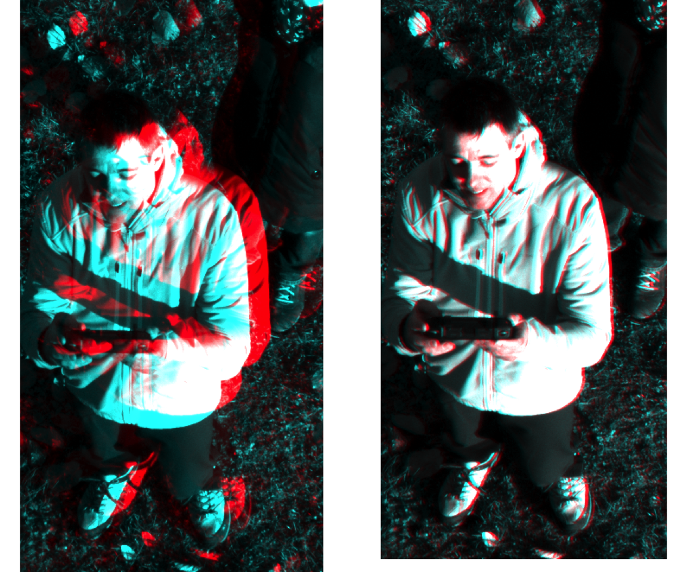
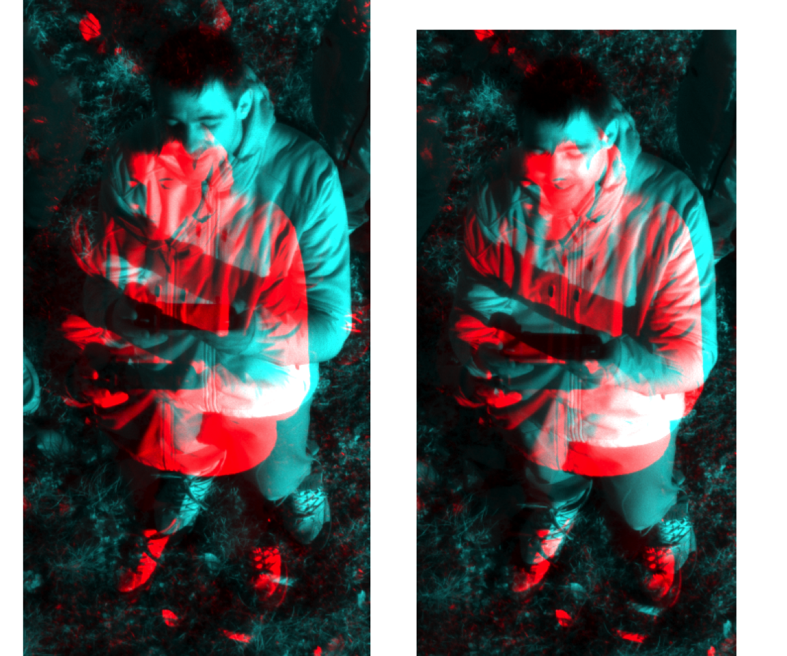
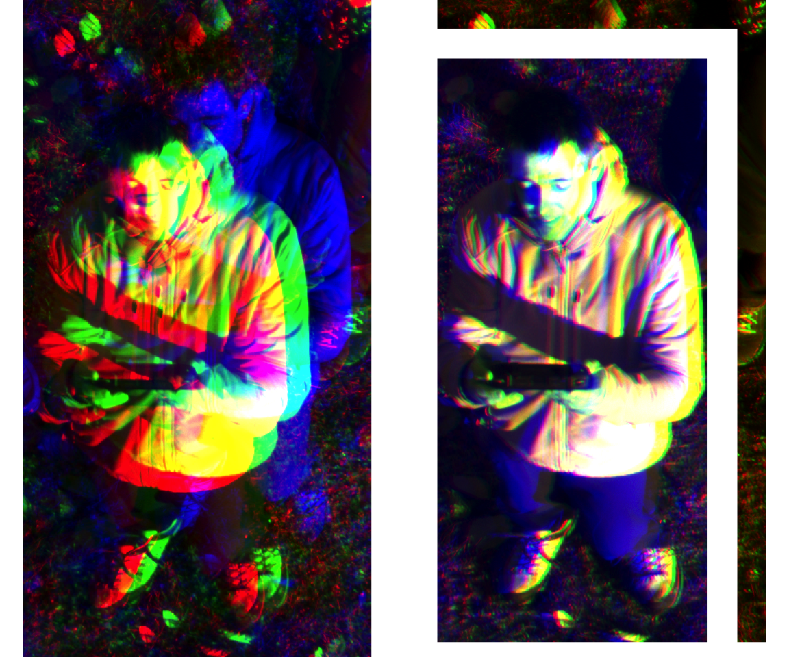

Drone Multispectral Coregistration (Crop Dataset) - Complete Fusion
================
Iris Nana Obeng
2026-02-04

``` r
library(terra)
library(imager)
setwd("~/Desktop/drone ms coregistration")
```

## Load multispectral bands

``` r
files <- c("ms_crop_gre.tif", "ms_crop_red.tif", "ms_crop_nir.tif")
ms <- rast(files)
names(ms) <- c("Green", "Red", "NIR")
```

## Shift Functions

``` r
align_band_simple <- function(ref_mat, target_mat, max_shift = 20) {
  best_cor <- -Inf; best_dx <- 0; best_dy <- 0
  rows <- nrow(ref_mat); cols <- ncol(ref_mat)

  for (dx in -max_shift:max_shift) {
    for (dy in -max_shift:max_shift) {

      shifted <- matrix(NA, rows, cols)

      r_dst <- (1:rows) + dy
      c_dst <- (1:cols) + dx

      ok_r <- r_dst >= 1 & r_dst <= rows
      ok_c <- c_dst >= 1 & c_dst <= cols

      shifted[r_dst[ok_r], c_dst[ok_c]] <-
        target_mat[(1:rows)[ok_r], (1:cols)[ok_c]]

      valid <- is.finite(ref_mat) & is.finite(shifted)

      if (sum(valid) > 1000) {
        cc <- suppressWarnings(cor(ref_mat[valid], shifted[valid]))
        if (!is.na(cc) && cc > best_cor) {
          best_cor <- cc; best_dx <- dx; best_dy <- dy
        }
      }
    }
  }
  list(dx = best_dx, dy = best_dy, cor = best_cor)
}

apply_shift <- function(mat, dx, dy) {
  rows <- nrow(mat); cols <- ncol(mat)
  shifted <- matrix(NA, rows, cols)

  r_dst <- (1:rows) + dy
  c_dst <- (1:cols) + dx

  ok_r <- r_dst >= 1 & r_dst <= rows
  ok_c <- c_dst >= 1 & c_dst <= cols

  shifted[r_dst[ok_r], c_dst[ok_c]] <-
    mat[(1:rows)[ok_r], (1:cols)[ok_c]]

  shifted
}
```

## Edge Detection

``` r
get_edges <- function(img){

  im <- as.cimg(t(img))
  im <- (im - min(im)) / (max(im) - min(im))

  sobel_x <- as.cimg(matrix(c(-1,0,1,-2,0,2,-1,0,1),3,3))
  sobel_y <- as.cimg(matrix(c(-1,-2,-1,0,0,0,1,2,1),3,3))

  sobx <- imager::convolve(im, sobel_x)
  soby <- imager::convolve(im, sobel_y)

  edges <- sqrt(sobx^2 + soby^2)
  edges <- edges / max(edges)

  edges[edges < 0.2] <- 0
  edges[edges >= 0.2] <- 1

  t(as.matrix(edges))
}
```

## Edge-based Alignment

``` r
align_band_edges <- function(ref_rast, target_rast, max_shift = 30){

  ref <- as.matrix(ref_rast, wide=TRUE)
  tgt <- as.matrix(target_rast, wide=TRUE)

  ref[!is.finite(ref)] <- 0
  tgt[!is.finite(tgt)] <- 0

  ref_e <- get_edges(ref)
  tgt_e <- get_edges(tgt)

  best_cor <- -Inf; best_dx <- 0; best_dy <- 0

  for (dx in -max_shift:max_shift){
    for (dy in -max_shift:max_shift){

      shifted <- apply_shift(tgt_e, dx, dy)
      valid <- is.finite(ref_e) & is.finite(shifted)

      if (sum(valid) > 1000){
        cc <- suppressWarnings(cor(ref_e[valid], shifted[valid]))

        if (!is.na(cc) && cc > best_cor){
          best_cor <- cc
          best_dx <- dx
          best_dy <- dy
        }
      }
    }
  }

  list(dx = best_dx, dy = best_dy, cor = best_cor)
}
```

## Coregister Bands

``` r
ref_red <- ms$Red
green   <- ms$Green
nir     <- ms$NIR

ref_red_mat <- as.matrix(ref_red, wide=TRUE)
green_mat   <- as.matrix(green, wide=TRUE)
nir_mat     <- as.matrix(nir, wide=TRUE)

# Green alignment
res_green <- align_band_simple(ref_red_mat, green_mat)

green_aligned <- apply_shift(green_mat,
                             res_green$dx,
                             res_green$dy)

green_r <- rast(green_aligned)
ext(green_r) <- ext(ref_red)
crs(green_r) <- crs(ref_red)

cat(sprintf("✓ Green aligned (dx=%d, dy=%d, cor=%.3f)\n",
            res_green$dx, res_green$dy, res_green$cor))
```

    ## ✓ Green aligned (dx=20, dy=-15, cor=0.877)

``` r
# NIR alignment
res_nir <- align_band_edges(ref_red, nir)

nir_spatial <- apply_shift(nir_mat,
                           res_nir$dx,
                           res_nir$dy)

nir_spatial_r <- rast(nir_spatial)
ext(nir_spatial_r) <- ext(ref_red)
crs(nir_spatial_r) <- crs(ref_red)

cat(sprintf("✓ NIR aligned (dx=%d, dy=%d, edge-cor=%.3f)\n",
            res_nir$dx, res_nir$dy, res_nir$cor))
```

    ## ✓ NIR aligned (dx=-28, dy=30, edge-cor=0.029)

## Sub-pixel Refinement (Knit-Safe)

``` r
cat("\n--- Refining to 0.1 pixel accuracy ---\n")
```

    ## 
    ## --- Refining to 0.1 pixel accuracy ---

``` r
ref_mat <- as.matrix(ref_red, wide=TRUE)
nir_mat <- as.matrix(nir_spatial_r, wide=TRUE)

best_cor <- res_nir$cor
best_dx_sub <- 0
best_dy_sub <- 0
# --- micro refinement around best shift ---
for (dx in seq(best_dx_sub-0.3, best_dx_sub+0.3, by=0.05)) {
  for (dy in seq(best_dy_sub-0.3, best_dy_sub+0.3, by=0.05)) {

    nir_shifted <- imshift(as.cimg(t(nir_mat)), dx, dy)
    nir_shifted <- t(as.matrix(nir_shifted))

    overlap <- !is.na(ref_mat) & !is.na(nir_shifted)
    if (sum(overlap) > 1000) {
      cc <- cor(ref_mat[overlap], nir_shifted[overlap])

      if (!is.na(cc) && cc > best_cor) {
        best_cor <- cc
        best_dx_sub <- dx
        best_dy_sub <- dy
      }
    }
  }
}


if (abs(best_dx_sub) > 0.05 || abs(best_dy_sub) > 0.05) {

  cat(sprintf("✓ Subpixel refinement: dx=%.2f dy=%.2f cor=%.3f\n",
              best_dx_sub, best_dy_sub, best_cor))

  nir_final <- imshift(as.cimg(t(nir_mat)),
                       best_dx_sub,
                       best_dy_sub)

  nir_final <- t(as.matrix(nir_final))
  nir_r <- rast(nir_final)

} else {

  cat("No subpixel improvement found\n")
  nir_r <- nir_spatial_r
}
```

    ## ✓ Subpixel refinement: dx=-0.30 dy=-0.30 cor=0.505

``` r
ext(nir_r) <- ext(ref_red)
crs(nir_r) <- crs(ref_red)
```

## RGB Visualization

``` r
rg_before <- c(ms$Red, ms$Green, ms$Green)
rg_after  <- c(ref_red, green_r, green_r)

rn_before <- c(ms$Red, ms$NIR, ms$NIR)
rn_after  <- c(ref_red, nir_r, nir_r)

rgb_before <- c(ms$Green, ms$Red, ms$NIR)
rgb_after  <- c(green_r, ref_red, nir_r)
```

## Red + Green

``` r
par(mfrow = c(1,2), mar = c(2,2,3,1))

plotRGB(rg_before, r=1,g=2,b=3, stretch="lin",
        main="Red + Green - Before Alignment")

plotRGB(rg_after, r=1,g=2,b=3, stretch="lin",
        main="Red + Green - After Alignment")
```

<!-- -->

``` r
par(mfrow = c(1,1))
```

## Red + NIR

``` r
par(mfrow = c(1,2), mar = c(2,2,3,1))

plotRGB(rn_before, r=1,g=2,b=3, stretch="lin",
        main="Red + NIR - Before Alignment")

plotRGB(rn_after, r=1,g=2,b=3, stretch="lin",
        main="Red + NIR - After Alignment")
```

<!-- -->

``` r
par(mfrow = c(1,1))
```

## Green + Red + NIR

``` r
par(mfrow = c(1,2), mar = c(2,2,3,1))

plotRGB(rgb_before, r=1,g=2,b=3, stretch="lin",
        main="Green + Red + NIR - Before Alignment")

plotRGB(rgb_after, r=1,g=2,b=3, stretch="lin",
        main="Green + Red + NIR - After Alignment")
```

<!-- -->

``` r
par(mfrow = c(1,1))
```

``` r
cat("\n✓ Coregistration complete\n")
```

    ## 
    ## ✓ Coregistration complete
